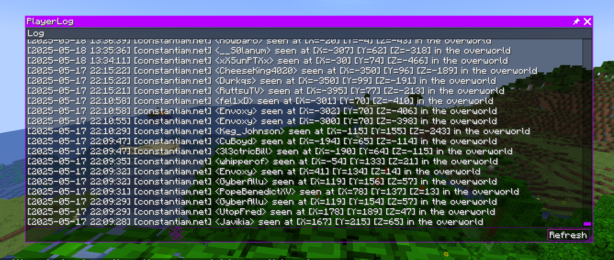

# RusherHack PlayerLog Plugin

Rusherhack plugin that log all player encounters in a log file and display them in the chat

# Features

#### Player Logging
- Log everyone that enter the render distance

#### Optional Chat Logging
- Logs can be displayed directly in Minecraft chat

#### Optional File Logging
- Logs can be saved in a local text file (.minecraft/rusherhack/logs/player_log.txt)

#### In-Game Log Viewer Window
- A rusherhack window module to read the log file directly in game

#### Log all important information
- Log the date, server IP, name, coordinate and dimension

#### NPC / Fake Player Filter
- Fake players (e.g. on mini-game servers) are automatically ignored to avoid false positives.

# Screenshots

#### Exemple of log in the chat

#### Windows module that show the log file
